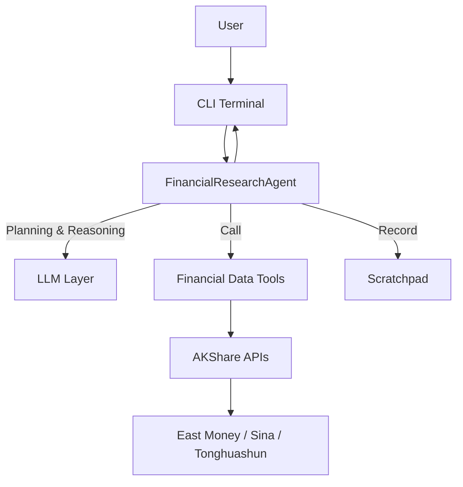

<div align="center">


[](https://www.python.org/downloads/)
[](LICENSE)
[](https://github.com/akfamily/akshare)

**OpenFR: Lightweight Financial Research Agent | Powered by AKShare | Multi-LLM Support | Automated Data & Analysis**

[Quick Start](#quick-start) • [Features](#features) • [Usage](#usage) • [Configuration](#configuration) • [Architecture](#architecture)

</div>

Below is a full request example for "Is Kweichow Moutai a good buy?" as shown in the terminal (three screenshots for different stages of the same request):

<table>
  <tr>
    <td align="center">
      <br/>
      <sub>Fig 1: LLM plans research steps (Plan-Execute planning phase)</sub>
    </td>
    <td align="center">
      <br/>
      <sub>Fig 2: Calling financial data tools step by step and showing intermediate results</sub>
    </td>
    <td align="center">
      <br/>
      <sub>Fig 3: Final conclusion and investment advice based on all steps</sub>
    </td>
  </tr>
</table>

---

## 📊 Overview

OpenFR (Open Financial Research) is a **minimal, lightweight** intelligent financial research Agent. It is built on large language models and integrates AKShare data APIs to provide automated query and analysis for stocks, funds, futures, indices, macroeconomics, and more.

<a id="features"></a>
### ✨ Features

- 🌱 **Minimal & Lightweight** - Pure Python package + Typer CLI, AKShare data only, one command to start researching
- 🤖 **Plan-Execute Agent** - Plan 2–5 steps with LLM, then execute tool calls step by step and synthesize answers
- ⚡ **Performance** - Parallel read-only tool calls, multi-source retry and fallback, result truncation and context compression
- 🎯 **Smart Tool Selection** - Picks the most relevant market / sector / macro tools by question type
- 📈 **Rich Data** - 35+ financial data tools: A-shares, HK stocks, funds, futures, indices, macro and sectors
- 🔄 **Multi-LLM** - 15+ providers (domestic, overseas, local)
- 🎨 **Nice CLI** - Rich terminal UI with live planning, tool calls, and final analysis
- 🔌 **Fallback Sources** - East Money + Sina + Tonghuashun with automatic switch and retry
- 💾 **Cache & Rate-Limit Friendly** - Stock list cache 6h, some quote cache 1min
- 📝 **Chat Memory & Scratchpad** - Recent dialogue and tool history for multi-turn follow-ups
- 🛡️ **Error Recovery** - Retry, fallback, and “finish with available info” when needed

---

<a id="architecture"></a>
## 🏗️ Architecture

### System Diagram



### Architecture Notes

**Unified Plan-Execute flow**
- LLM plans 2–5 research steps per question, then tools are called step by step
- Key info is written to Scratchpad after each step; final answer is synthesized from all steps

**Performance**
- **Cache**: Stock code list cached 6h; some quote data short-term cached
- **Parallel tools**: Read-only tools (quotes, indices, macro) can run in parallel via `OPENFR_ENABLE_PARALLEL_TOOLS`
- **Multi-source fallback**: Indices, sectors, A-share quotes use East Money / Sina / Tonghuashun with retry
- **Context compression**: Long tool results are truncated so only key info goes back to the LLM

**Data layer**
- **Multi-source**: East Money (primary) + Sina (backup)
- **Retry**: Auto retry on network errors with exponential backoff
- **Fallback**: Switch to backup when primary fails

---

<a id="quick-start"></a>
## 🚀 Quick Start

### Install

```bash
# Clone repo
git clone https://github.com/openmozi/openfr.git
cd openfr

# Create virtual environment
python -m venv .venv
source .venv/bin/activate  # Windows: .venv\Scripts\activate

# Install
pip install -e .
```

### Configure

Create a `.env` file and set your API key:

```bash
# Recommended default: Zhipu AI
ZHIPU_API_KEY=your_zhipu_api_key_here
OPENFR_PROVIDER=zhipu
OPENFR_MODEL=glm-4.7
```

See **[Configuration](#configuration)** below for more options.

### Run

```bash
# Start chat
openfr chat

# Then ask questions
You: What's Kweichow Moutai's price today?
You: Search for CATL
You: How is the Shanghai Composite Index doing?
```

### Basic usage

#### 1. Start chat

```bash
# Interactive mode (recommended)
openfr chat

# Or specify provider and model
openfr chat -p zhipu -m glm-4.7
openfr chat -p anthropic
```

#### 2. Examples

After starting, type your question:

```
You: What's Kweichow Moutai's price today?
You: Search for CATL
You: Analyze today's hot sectors
You: How is the Shanghai Composite Index?
```

**End-to-end test** (needs API key):

```bash
openfr query "Is Kweichow Moutai a good buy?"
```

You’ll see: task plan (steps) → Step 1/N … N/N (tool calls) → final answer. If a source is temporarily down, you’ll get a notice and an answer based on available data.

#### 3. Tools and providers

```bash
# List financial data tools
openfr tools

# List supported providers
openfr providers
```

---

<a id="usage"></a>
## 📖 Usage

### Supported query types

With `openfr chat` you can ask:

#### 📈 A-share

```
# Real-time quotes
Quote for 000001
Ping An Bank price today

# History
Kweichow Moutai last week
History for 600519 from 20240101 to 20240131

# Search
Search Moutai
Find new energy related stocks

# News
Ping An Bank latest news

# Hot stocks
Today's hot stocks
```

#### 🇭🇰 HK stocks

```
# Real-time
Quote HK 00700
Tencent price today
Alibaba 09988 latest

# History
HK 00700 last month
History for 09988

# Search
Search HK Tencent
Search HK Li Auto
```

#### 🇺🇸 US stocks (not supported yet)

US quotes and history are not supported in the current version; docs will be updated if a stable source is added.

#### 💼 Funds

```
# ETF
Quote 510300 ETF
How is CSI 300 ETF today?

# Fund ranking
Equity fund ranking
Funds by 1-year performance
```

#### 📊 Indices and sectors

```
# Indices
Shanghai Composite today
ChiNext index latest

# Sectors
Today's top sectors by gain
How is the tech sector?
```

#### 🌍 Macro

```
# Indicators
Latest CPI
Recent GDP growth
PMI trend
```

---

<a id="configuration"></a>
## ⚙️ Configuration

### Environment variables

Create a `.env` file. Main options (full list in `openfr.config.Config.from_env`):

```bash
# ============= Common (recommended) =============
OPENFR_PROVIDER=zhipu
OPENFR_MODEL=glm-4.7
ZHIPU_API_KEY=your_zhipu_api_key_here

# ============= LLM =============
OPENFR_TEMPERATURE=0.0
OPENFR_MAX_TOKENS=4096
OPENFR_MAX_ITERATIONS=10
OPENFR_VERBOSE=true

# ============= Performance =============
OPENFR_ENABLE_PARALLEL_TOOLS=true
OPENFR_ENABLE_PARALLEL_SOURCES=true

# ============= Tool toggles (all on by default) =============
OPENFR_ENABLE_STOCK_TOOLS=true
OPENFR_ENABLE_STOCK_HK_TOOLS=true
OPENFR_ENABLE_FUND_TOOLS=true
OPENFR_ENABLE_FUTURES_TOOLS=true
OPENFR_ENABLE_MACRO_TOOLS=true
OPENFR_ENABLE_INDEX_TOOLS=true

# ============= Agent =============
OPENFR_ENABLE_PLAN_EXECUTE=true
OPENFR_ENABLE_SELF_VALIDATION=true
OPENFR_ENABLE_LOOP_DETECTION=true
OPENFR_MAX_TOTAL_TOOL_CALLS=14
```

### Provider list and API keys

- **provider**: use with `openfr chat/query -p <provider>` or `OPENFR_PROVIDER` in `.env`
- **API Key**: set the env var in the table below
- **Default model**: used when `OPENFR_MODEL` is not set; override with `OPENFR_MODEL=<model>`

| provider | API Key env var | Default model | Notes |
|---|---|---|---|
| deepseek | `DEEPSEEK_API_KEY` | `deepseek-chat` | OpenAI-compatible |
| doubao | `DOUBAO_API_KEY` | `doubao-1-5-pro-256k` | OpenAI-compatible |
| dashscope | `DASHSCOPE_API_KEY` | `qwen-max` | OpenAI-compatible |
| zhipu | `ZHIPU_API_KEY` | `glm-4.7` | OpenAI-compatible (default) |
| modelscope | `MODELSCOPE_API_KEY` | `qwen2.5-72b-instruct` | OpenAI-compatible |
| kimi | `KIMI_API_KEY` | `moonshot-v1-128k` | OpenAI-compatible |
| stepfun | `STEPFUN_API_KEY` | `step-2-16k` | OpenAI-compatible |
| minimax | `MINIMAX_API_KEY` | `MiniMax-Text-01` | OpenAI-compatible |
| openai | `OPENAI_API_KEY` | `gpt-4o` | Official OpenAI |
| anthropic | `ANTHROPIC_API_KEY` | `claude-sonnet-4-20250514` | Dedicated SDK |
| openrouter | `OPENROUTER_API_KEY` | `stepfun/step-3.5-flash:free` | Free tier |
| together | `TOGETHER_API_KEY` | `meta-llama/Llama-3.3-70B-Instruct-Turbo` | OpenAI-compatible |
| groq | `GROQ_API_KEY` | `llama-3.3-70b-versatile` | OpenAI-compatible |
| modelsproxy | `MODELSPROXY_API_KEY` | `minimax-m2.1` | OpenAI-compatible |
| ollama | `OLLAMA_BASE_URL` | `qwen2.5:14b` | Local; default URL `http://localhost:11434` |
| custom | `CUSTOM_API_KEY` + `CUSTOM_BASE_URL` | (empty) | Custom OpenAI-compatible endpoint |

---

## 🛠️ Development

### Project layout

```
openfr/
├── src/openfr/
│   ├── __init__.py
│   ├── agent.py            # Agent core (plan + execute)
│   ├── chat_history.py     # Multi-turn chat
│   ├── cli.py              # CLI entry
│   ├── config.py           # Config
│   ├── prompts.py          # Prompts
│   ├── formatter.py        # UI formatting
│   ├── scratchpad.py       # State
│   └── tools/              # Tools
│       ├── __init__.py
│       ├── base.py
│       ├── cache.py
│       ├── constants.py
│       ├── context.py
│       ├── parallel.py
│       ├── selector.py
│       ├── valuation.py
│       ├── metrics.py
│       ├── errors.py
│       ├── stock.py
│       ├── stock_ext.py
│       ├── stock_hk.py
│       ├── fund.py
│       ├── futures.py
│       ├── index.py
│       ├── macro.py
│       └── registry.py
├── tests/
│   └── test_integration.py
├── docs/
│   ├── optimization_report.md
│   └── execution_optimization.md
├── examples/
│   └── optimization_examples.py
├── pyproject.toml
├── README.md
├── README_EN.md
└── .env.example
```

## 🐛 Troubleshooting

### Common issues

#### 1. API key not set

**Error:** `Warning: ZHIPU_API_KEY not set`

**Fix:**
```bash
# In .env
ZHIPU_API_KEY=your-api-key-here

# Or temporarily
export ZHIPU_API_KEY=your-api-key-here
```

#### 2. Network errors

**Error:** `Connection aborted`, `Remote end closed connection`

**Fix:**
- Auto retry (up to 3 times)
- Fallback to backup data source after a short wait
- Check network or retry later if it keeps failing

#### 3. Data API unavailable

**Error:** `❌ Unable to get index real-time quote`

**Causes:**
- Outside market hours (weekdays 9:30–15:00)
- Source under maintenance
- Network restrictions

**Fix:**
- Use history APIs instead
- Query specific symbols instead of full market
- Retry later

## 🤝 Contributing

Contributions (code, issues, ideas) are welcome.

### How to contribute

1. Fork the repo
2. Create a branch (`git checkout -b feature/AmazingFeature`)
3. Commit (`git commit -m 'Add some AmazingFeature'`)
4. Push (`git push origin feature/AmazingFeature`)
5. Open a Pull Request

### Code style

- Format with Black
- Lint with Ruff
- Add type hints where useful
- Add tests when possible

---

## 🙏 Acknowledgments

- [AKShare](https://github.com/akfamily/akshare) - Financial data APIs
- [LangChain](https://github.com/langchain-ai/langchain) - Agent framework
- [Rich](https://github.com/Textualize/rich) - Terminal UI
- [Typer](https://github.com/tiangolo/typer) - CLI framework

---

<div align="center">

**[⬆ Back to top](#openfr-lightweight-financial-research-agent)**

[中文](README.md) | English

Made with ❤️ by OpenFR Team

</div>
